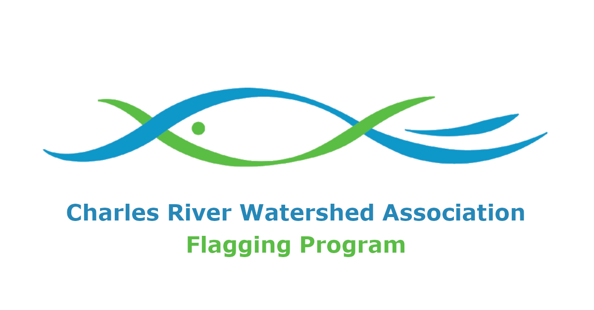

This documentation provides developers and maintainers information about the CRWA's flagging website, including information on: deploying the website, developing the website, using the website's code locally, and using the website's admin panel.

## For Website Administrators

If the website is already deployed and you want to implement a manual override, you do not need to follow the setup guide. All you need to do is read the [admin guide](admin).

## Connecting to Weebly

The outputs of the model can be exported as an iFrame, which allows the flagging website's live data to be viewed on a statically rendered web page (such as those hosted by Weebly).

To export the model outputs using an iFrame, use the following HTML:

```html
<div style="position:relative; overflow:hidden; width:100%; padding-top:75%;">
<iframe src="{{ flagging_website_url }}/flags" style="position:absolute; top:0; left:0; bottom:0; right:0; width:100%; height:100%;"></iframe>
```

## For Developers

Start by following the [setup guide](setup). Once you have the website setup locally, you now have access to the following:

- Deploy the website to Heroku (guide [here](deployment))
- Manually run commands and download data through the [shell](shell).
- Make changes to the predictive model, including revising its coefficients. (Guide is currently WIP)
- (Advanced) Make other changes to the website.
